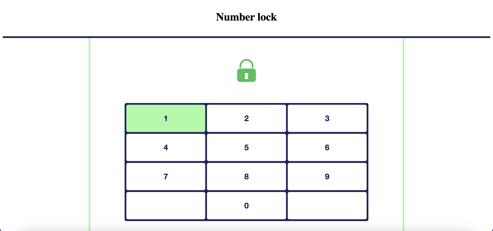

# Number Lock with React

Using PinInput from react-pin-input and Keyboard from react-simple-keyboard.

The lock opens with the correct 4-digit code.

## How to get it running

Clone the app and run

### npm install

in your local project directory.